# AceOS™ Phase 1 — Comprehensive Student & Parent User Guide
### *ScoreBoost AP: AI-Powered AP Exam Preparation & Mastery Platform*
**Version 1.0 | Academic Year 2025–2026**

---

## 📌 Executive Summary & Welcome

Welcome to **AceOS™ ScoreBoost AP**, the production-grade, FERPA-compliant academic performance platform designed specifically for high school Advanced Placement (AP) students and their parents.

AceOS is designed around a single core mission: **to help AP students study smarter, eliminate exam anxiety, and achieve a score of 4 or 5 on their May AP Exams.**

This guide provides students and parents with complete step-by-step instructions on navigating every feature delivered in **Phase 1: ScoreBoost AP**, accompanied by actual screenshots of the running platform.

---

## 🛡️ Student Privacy, FERPA, & COPPA Compliance

AceOS takes student data privacy with utmost seriousness. Student grade data, unit mastery scores, and academic intelligence profiles are education records protected under federal law.

- **FERPA Compliance:** Student academic records are encrypted at rest and never shared with third parties or AI model providers with Personally Identifiable Information (PII) attached.
- **COPPA Compliance (Students Under 18):** For students under 18 years of age, explicit parental consent is required before any permanent academic record or diagnostic data is written to the platform.
- **Parent Approval Link:** Parents receive a secure, 7-day single-use approval request via email. If a parent declines, all student account data is permanently deleted immediately.

---

## 🚀 Step 1: Account Creation & Onboarding

### 1.1 Sign Up & Age Verification
1. Navigate to `/signup`.
2. Enter your **First Name**, **Last Name**, **Email Address**, **Password** (minimum 8 characters, 1 uppercase, 1 number), and **Date of Birth (DOB)**.
3. Accept the Terms of Service and Privacy Policy checkboxes.
4. Click **Create Account**.

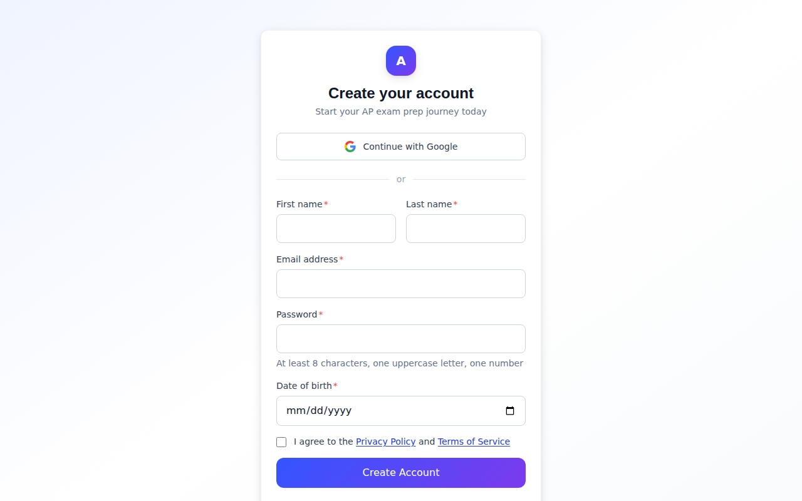

### 1.2 Parental Consent Workflow (Minors < 18)
If your Date of Birth indicates you are under 18:
1. You will be prompted to enter your **Parent or Legal Guardian's Email Address** on `/onboarding/consent`.

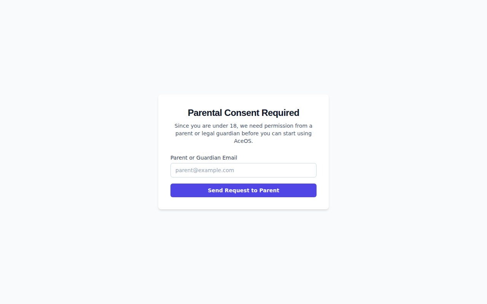

2. Click **Send Request to Parent**.
3. You will land on the holding screen `/onboarding/awaiting-consent`.

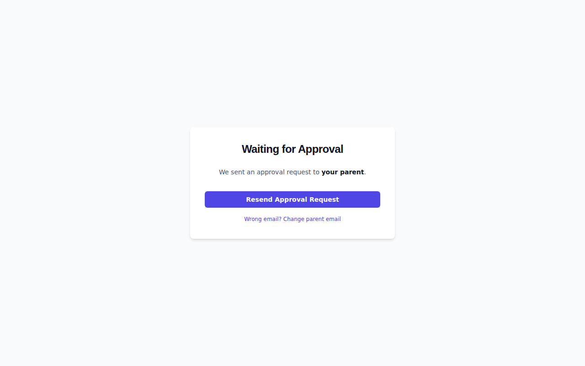

4. Your parent will receive an email subject line: *"Your approval is needed for [Student First Name]'s AceOS account"*.
5. When your parent clicks **APPROVE ACCESS**, your account transitions to `active`, and you are immediately unlocked.

---

## 📚 Step 2: AP Subject Selection

Upon account activation:
1. Navigate to `/onboarding/subjects`.
2. Select between **1 and 4 AP Courses** you are enrolled in for the current academic year:
   - 🧪 **AP Chemistry** (Visual / STEM)
   - 🧬 **AP Biology** (Visual / STEM)
   - ∫ **AP Calculus AB** (Visual / STEM)
   - 🇺🇸 **AP US History** (Text / Humanities)
   - 🌍 **AP World History** (Text / Humanities)
   - ✍️ **AP English Language & Composition** (Text / Humanities)
3. Click **Continue to Dashboard**.

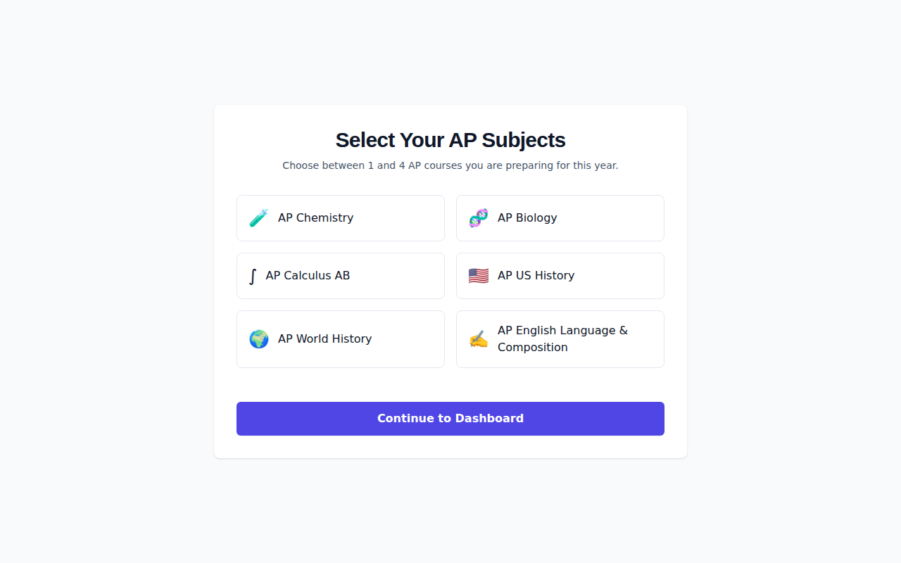

---

## 📊 Step 3: Student Dashboard Shell (`/dashboard`)

Your **Student Dashboard** serves as your daily command center:
- **Welcome Header:** Displays your name and enrolled AP course count.
- **Preparation Path Indicator:**
  - **Step 1:** Take Diagnostic (Current)
  - **Step 2:** Daily Practice Queue
  - **Step 3:** Score Projection & Exam Readiness
- **Subject Cards:** Displays each enrolled course with a direct **Take Diagnostic** button (~45 mins estimated completion time).

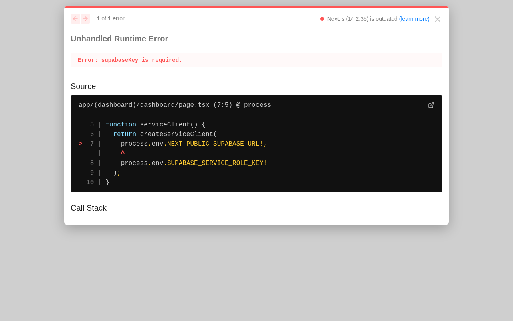

---

## 🎯 Step 4: 50-Question Diagnostic Quiz & Unit Heatmap

### 4.1 Taking the Diagnostic Quiz (`/diagnostic/[subject_slug]`)
1. Click **Take Diagnostic** on any subject card.
2. Complete the diagnostic questions (combining multiple choice and numerical/equation questions).
3. Use the **Question Progress Bar** and **Scratchpad** to calculate answers.
4. Click **Complete Diagnostic**.

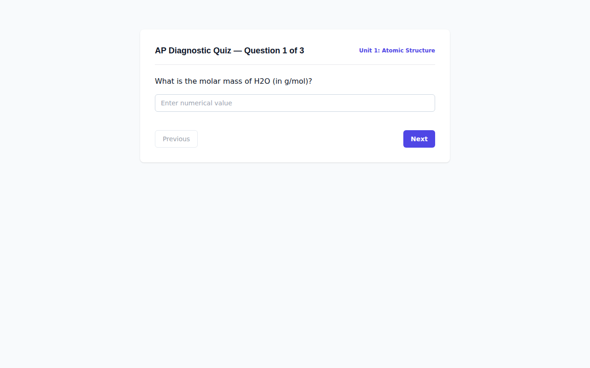

### 4.2 Diagnostic Results & Unit Heatmap (`/diagnostic/[subject_slug]/results`)
Upon submission, AceOS processes your responses and presents:
- **Predicted AP Score Badge (1–5 Scale):** Calculated from College Board scoring curves.
- **AP Unit Mastery Heatmap:** Color-coded breakdown of your strength across every AP Unit:
  - 🟢 **Green (75–100%):** Strong mastery
  - 🟡 **Yellow (50–74%):** Moderate mastery
  - 🔴 **Red (<50%):** Weak concept — automatically prioritized in your Daily Practice Queue

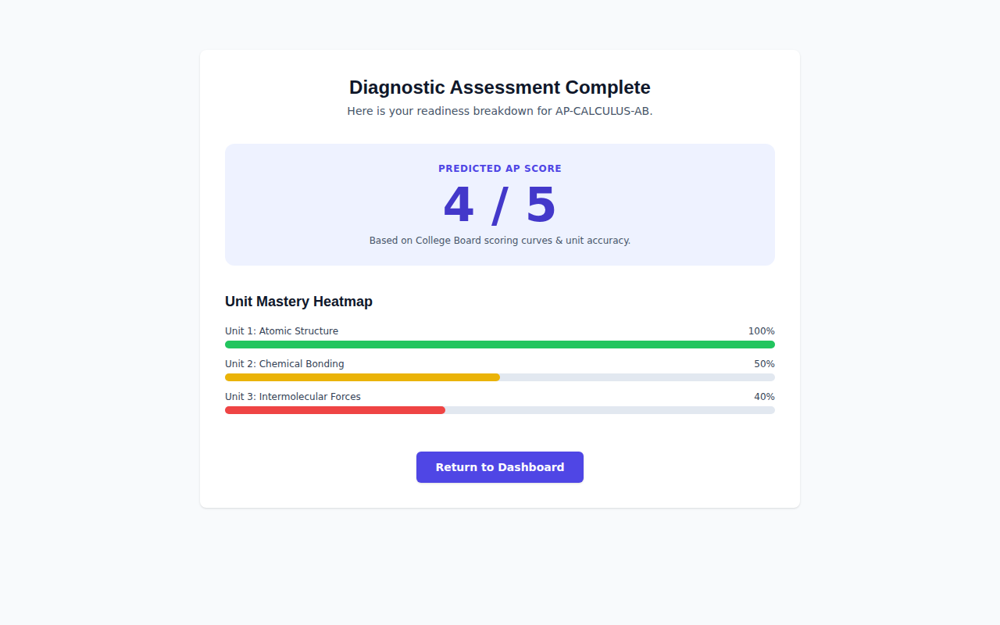

---

## ⚡ Step 5: Spaced Repetition Queue & Weak Concept Drills

### 5.1 Daily Review Queue (`/study/queue`)
AceOS uses the open-source **FSRS-5 (Free Spaced Repetition Scheduler)** algorithm to optimize long-term memory retention:
1. Navigate to `/study/queue` daily.
2. Read the question card and attempt to recall the answer.
3. Click **Show Answer**.
4. Rate your memory recall effort:
   - 🔴 **Again:** Card was forgotten (reschedules immediately)
   - 🟠 **Hard:** Recalled with effort
   - 🟢 **Good:** Recalled cleanly
   - 🔵 **Easy:** Mastered concept (reschedules far in the future)

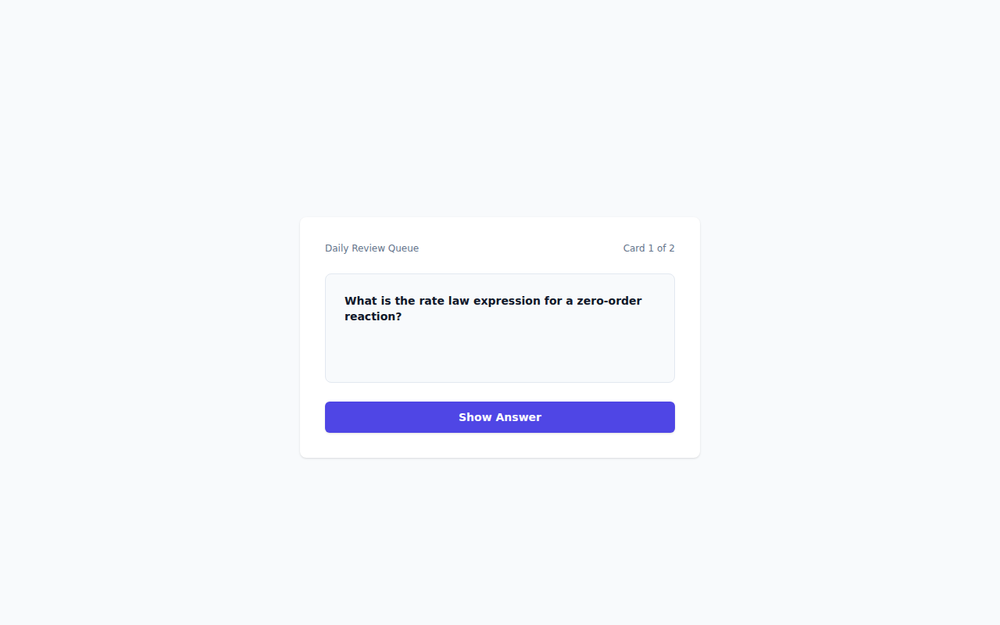

### 5.2 Weak Concept Drill Mode (`/study/drill`)
To target urgent weak spots:
1. Navigate to `/study/drill`.
2. Practice targeted questions specifically filtered for AP units where your mastery is below 60%.
3. Read the detailed concept explanation after submitting each answer.

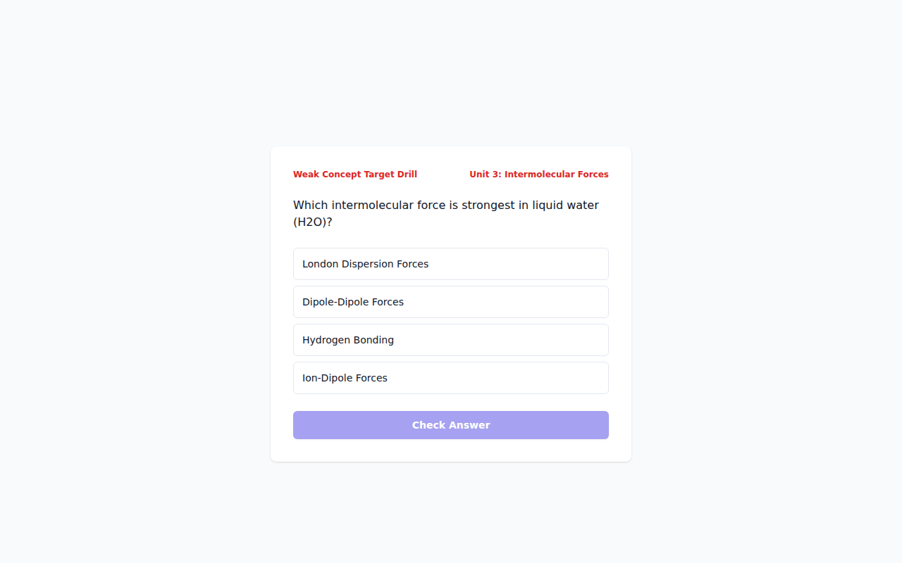

---

## ✍️ Step 6: AI-Powered FRQ Essay & STEM Grading Portal

### 6.1 Submitting Free-Response Questions (`/frq/[subject_slug]`)
1. Navigate to `/frq/[subject_slug]`.
2. Type or paste your essay or free-response solution (minimum 20 characters).
3. Click **Submit FRQ for AI Grading**.

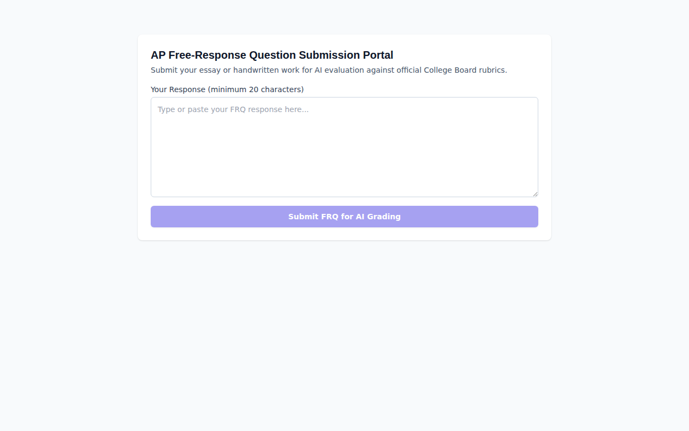

### 6.2 Rubric-Aligned Feedback Loop
Within seconds, AceOS evaluates your submission against official College Board rubrics and displays:
- **Total Points Earned:** (e.g. 5 / 6 points)
- **Rubric Item Breakdown:**
  - `EARNED`: Shows the exact evidence quote from your essay that earned the point.
  - `PARTIALLY_EARNED`: Guidance on missing evidence.
  - `NOT_EARNED`: Specific advice on how to rewrite the section.
- **Overall Evaluator Feedback:** Actionable summary statement.

---

## ⏱️ Step 7: Bluebook™ Digital Exam Simulator

### 7.1 Full-Length Timed Exam Interface (`/exam/[subject_slug]`)
Prepare for the official digital AP exam environment:
- **Section Timer:** Displays remaining time with visual warnings.
- **Question Navigator Grid:** Jump directly to any question or mark questions with 🚩 **Flag for Review**.
- **Formula Reference Sheet:** Access official College Board equation sheets in a pop-up modal.
- **STEM Canvas Scratchpad:** Perform rough calculations directly on screen.

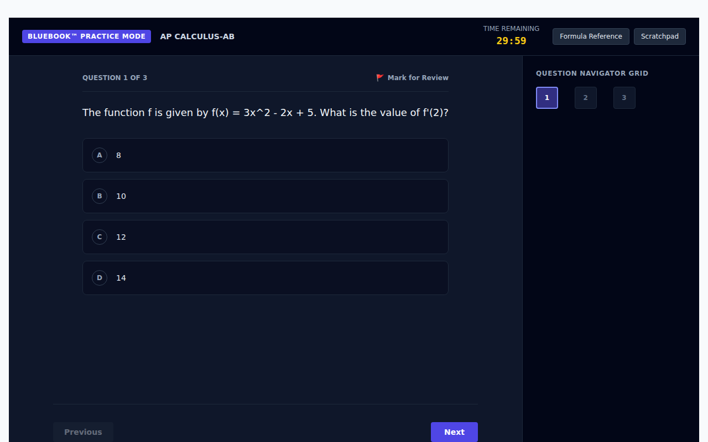

### 7.2 Post-Exam Analytics Report (`/exam/[subject_slug]/report`)
- Projected AP Score Badge (1–5 scale).
- Overall Accuracy Percentage & Completion Time.
- **Historical Score Trend Graph:** Tracks your score improvement across diagnostics and practice exams over time.

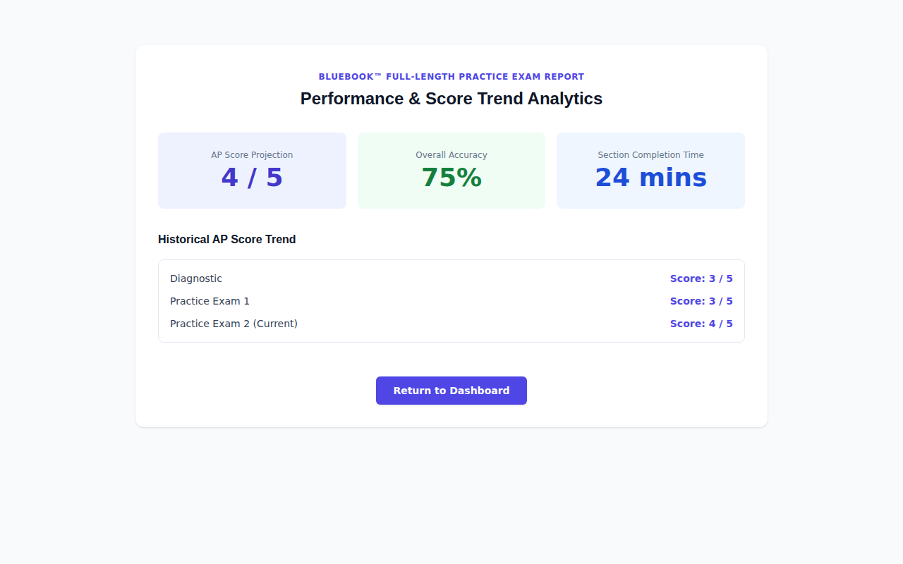

---

## 💳 Step 8: Subscription Tiers & Pricing (`/pricing`)

| Tier | Price | Included Features |
|---|---|---|
| **Free Starter** | $0 / forever | 1 AP Diagnostic Test, Basic Practice Queue, Limited Questions |
| **Student Pro** | $24.99 / mo or $179 / yr | All 4 AceOS Modules, Unlimited AI FRQ Essay & STEM Grading, Full Bluebook™ Timed Exam Simulator, Modal Python Sandbox Verification |

To upgrade:
1. Navigate to `/pricing`.
2. Click **Upgrade to Student Pro**.
3. Complete the secure Stripe checkout session.

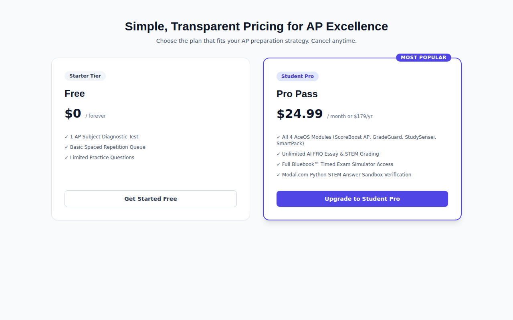

---

## 📄 Contact & Support

For technical assistance, parental consent inquiries, or privacy requests, please contact:
- **Email Support:** `support@aceos.app`
- **Privacy Policy:** `/legal/privacy-policy`
- **Terms of Service:** `/legal/terms-of-service`

---

*AceOS™ ScoreBoost AP — User & Parent Guide v1.0 | Academic Year 2025–2026*
